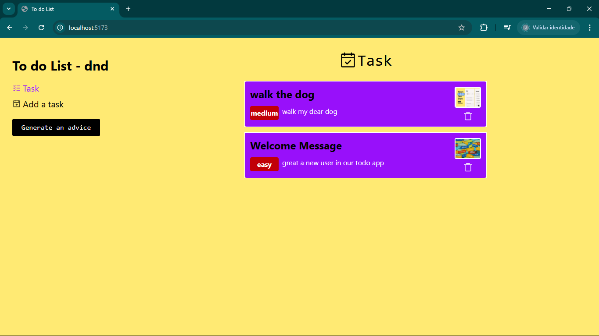

# 📝 Todo App com Drag and Drop

Um aplicativo de tarefas (Todo App) moderno e intuitivo, com suporte a **arrastar e soltar (Drag and Drop)** utilizando a biblioteca [`@hello-pangea/dnd`](https://github.com/hello-pangea/dnd).

 <!-- Imagem opcional -->

## 🚀 Funcionalidades

- ✅ Criar, editar e remover tarefas
- 🗂️ Organização por colunas (Ex: A Fazer, Em Progresso, Concluído)
- 🖱️ Arrastar e soltar tarefas para reordenar ou mover entre colunas
- 💾 Armazenamento local com `localStorage` (ou outro backend se aplicável)
- 🎨 UI moderna e responsiva com React

## 🛠️ Tecnologias Utilizadas

- **React** — Biblioteca principal da interface
- **@hello-pangea/dnd** — Fork de `react-beautiful-dnd` para funcionalidades de drag and drop
- **CSS / Tailwind CSS / Styled Components** — Estilização (especifique se usou uma delas)

## 📦 Instalação e Execução

```bash
# Clone o repositório
git clone https://github.com/seu-usuario/todo-dnd-app.git

# Acesse o diretório
cd todo-dnd-app

# Instale as dependências
npm install

# Inicie o servidor de desenvolvimento
npm start

